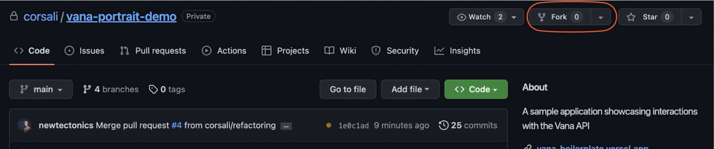
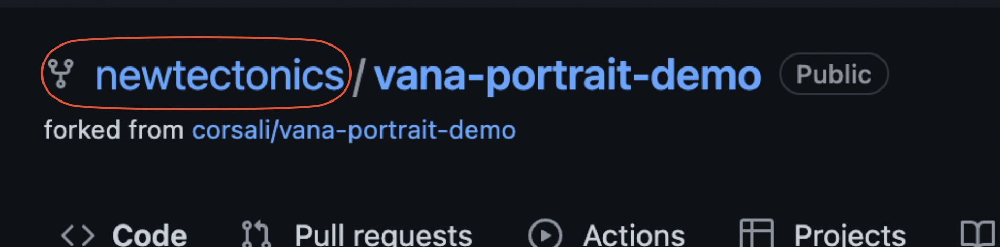
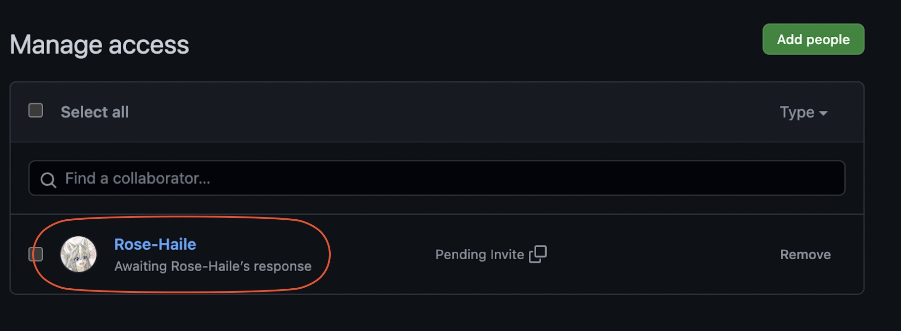
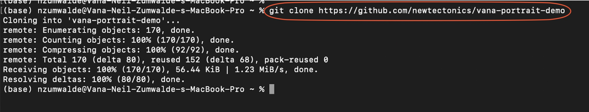
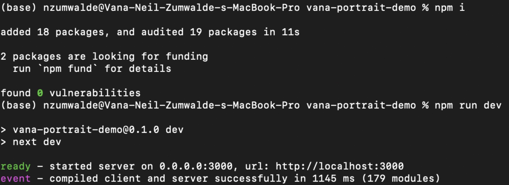
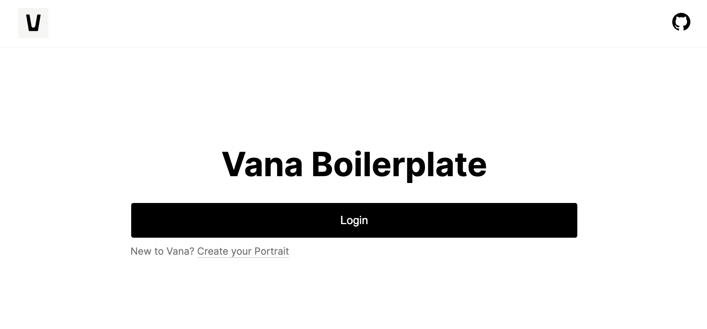

# Introduction

This is a Demo app created as an example of using Vana API. It is the way to get started quickly on the new project using the Next.js environment.

- [Vana API Documentation](https://vana.gitbook.io/api/) - The Vana API documentation
- [Installation Guide](#installation-guide) - How to get started with a new app

# <a name='installation-guide'>Installation Guide</a>

This project requires the following tools:

- [Node.js](https://nodejs.org/en/) - The JavaScript environment for server-side code.
- [NPM](https://www.npmjs.com/) - A Node.js package manager used to install dependencies.

## Getting Started

**Step 1. Fork the repository.**



**Step 2. Add your team members.**



**Step 3. Clone the code into a fresh folder.**

```
$ git clone https://github.com/corsali/vana-portrait-demo.git #make sure you replaced the git link to your fork
$ cd vana-portrait-demo
```



**Step 4. Install Dependencies.**

Next, we need to install the project dependencies, which are listed in `package.json`.

```
$ npm install
```

**Step 5. Run the app.**

```
$ npm run dev
```



Now you can start editing the page by modifying `pages/index.js`. The page auto-updates as you edit the file.

The app will become available on `http://localhost:3000`



## Deploy on Vercel

The easiest way to deploy your Next.js app is to use the [Vercel Platform](https://vercel.com/new?utm_medium=default-template&filter=next.js&utm_source=create-next-app&utm_campaign=create-next-app-readme) from the creators of Next.js.

To deploy the Demo app, you would need to [configure your project](https://vercel.com/new/clone?project-name=vana-portrait-demo&repository-name=vana-portrait-demo&repository-url=https%3A%2F%2Fgithub.com%2Fvana%2Fvana-portrait-demo).
