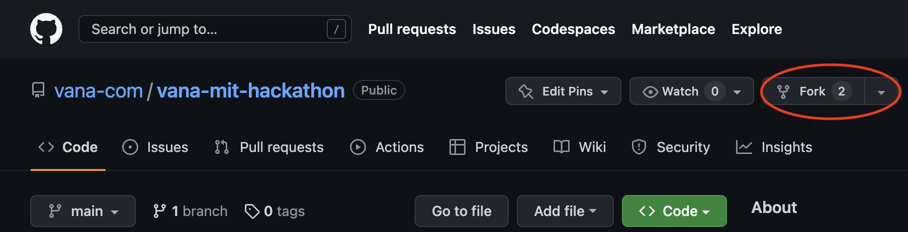
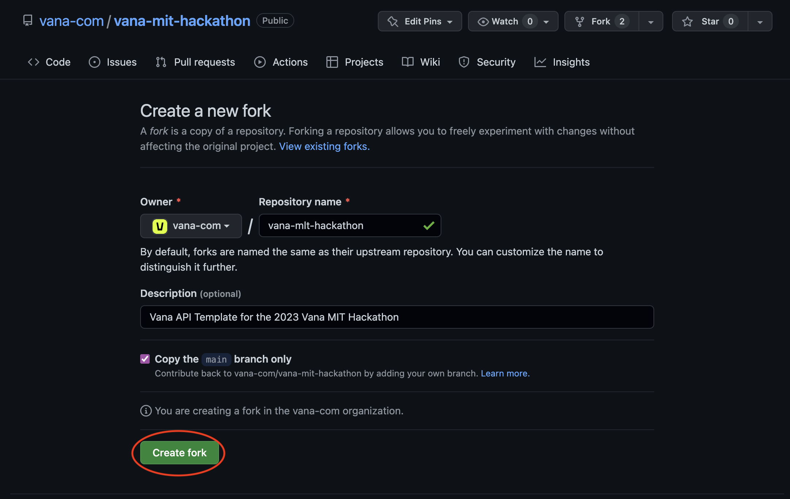
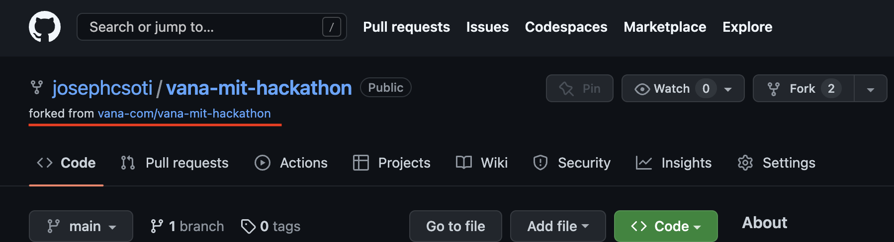
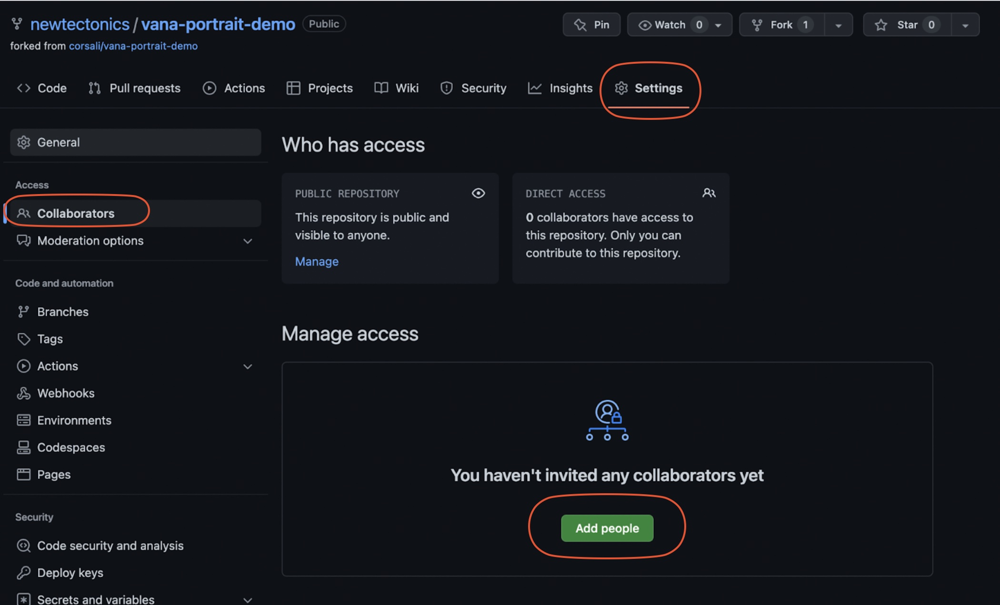
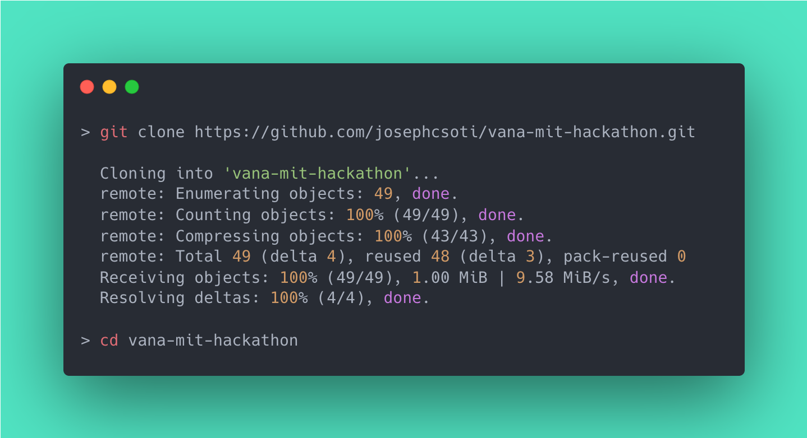
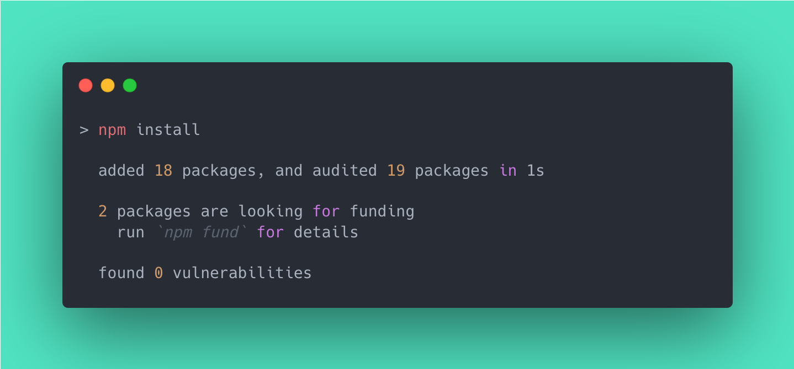
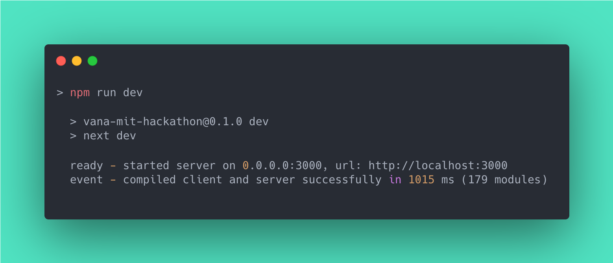

# Introduction

This is a demo app created as an example of using Vana API. It is the way to get started quickly on the new project using the Next.js environment.


New to git/npm and think it's a poekmon? [Start here](#detailed-start)

Want to put your skills to the test? [Start here](#quick-start)


# Prerequisites

This project requires the following tools:

- [Node.js](https://nodejs.org/en/) - The JavaScript environment for server-side code.
- [NPM](https://www.npmjs.com/) - A Node.js package manager used to install dependencies.

# Vana API

Take a look at the [Vana API Documentation](https://vana.gitbook.io/api/) on how to use our api and make your hackathon idea come to life

# Quick Start 


1. Fork this repo - [Tutorial](https://docs.github.com/en/get-started/quickstart/fork-a-repo)
2. Clone your fork: `git clone <your_fork_url>`
3. Install dependencies: `npm install`
4. Run app: `npm run dev`
5. View your app at `http://localhost:3000` and start editing `pages/index.js`

🎉 Woah there! Any faster and you would've broken the sound barrier. Spread that knowledge around and help a fellow sloanie out

# Detailed Start

New to git? New to node? That's okay -- we are all here to learn. Follow these more in-depth instructions and feel free to ask a sloanie or the vana team for help

## Step 1 - Create a fork


Click `Fork` in the top right of this repo


Keep the defaults and click `Create Fork`


You should see a new repo, under your account name, and with the words `forked from`


## Step 2 - Add team members
Be sure to add your team members so they can contribute


## Step 3 - Clone your fork

```
git clone <your_fork_url>
cd vana-mit-hackathon
```



## Step 4 - Install Dependencies

Next, we need to install the project dependencies, which are listed in `package.json`

```
npm install
```



## Step 5 - Run the app

```
npm run dev
```



🎉 Congrats!! You've just successfully setup what you'll need for the hackathon

Now you can start editing the page by modifying `pages/index.js`. The page auto-updates as you edit the file.

The app will become available on `http://localhost:3000`


# File Breakdown
Heres a brief overview of the files you'll lilkely be touching -- everything else is nextjs boilerplate

```
vana-mit-hackathon
  \pages
    index.js -- Homepage to handle prompt input & generating images
  \components
    \auth
      LoginHandler.js -- Component to handle login/code/token for you
  vanaApi.js -- Helper to make auth'd get/post calls to vana API
  ...
```

# Ready for the world to see it?
The easiest way to deploy your Next.js app to the internet is to use the [Vercel Platform](https://vercel.com/new) from the creators of Next.js.

